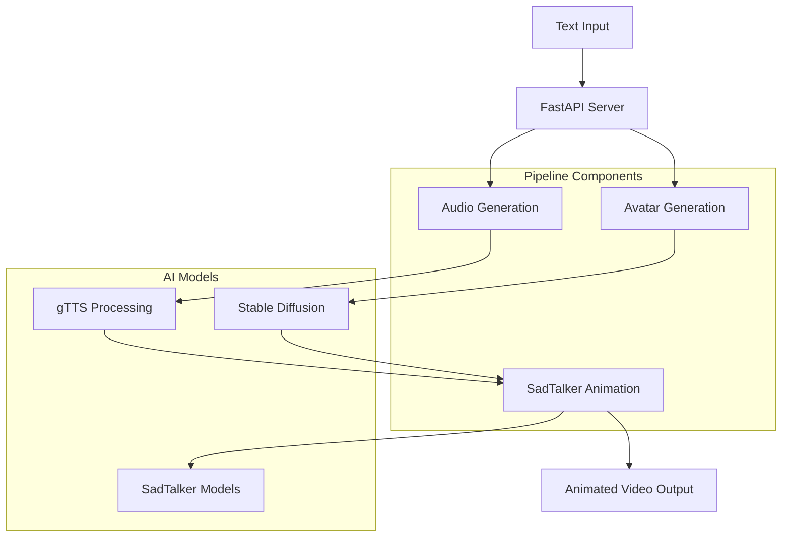

# 🤖 AI Avatar Pipeline

A real-time AI avatar generation system that converts text input into animated talking avatars using state-of-the-art AI models. This project combines text-to-speech, avatar image generation, and facial animation to create engaging AI-powered video content.

[](https://www.python.org/downloads/release/python-3110/)
[](https://fastapi.tiangolo.com/)
[](https://opensource.org/licenses/MIT)

## 🌟 Features

- **🎯 Real-time Text-to-Avatar**: Convert any text input into animated talking avatars
- **🎵 Advanced Text-to-Speech**: High-quality audio generation using Google TTS (gTTS)
- **🎨 AI Avatar Generation**: Create diverse avatar images using Stable Diffusion
- **🎬 Facial Animation**: Realistic lip-sync and facial movements using SadTalker
- **🚀 REST API**: Production-ready FastAPI server with WebSocket support
- **📊 Real-time Progress**: Live progress tracking for long-running operations
- **🔧 Modular Architecture**: Easily extensible and customizable components

## 🏗️ Architecture



## 🚀 Quick Start

### Prerequisites

- **Python 3.11+** (Required for optimal compatibility)
- **CUDA-compatible GPU** (Recommended for faster processing)
- **16GB+ RAM** (32GB recommended for optimal performance)
- **10GB+ free disk space** (for models and generated content)

### Installation

1. **Clone the repository**
```bash
git clone https://github.com/MuhammadMuazzain/AI-Avatar-Generator.git
cd ai-avatar-project
```

2. **Create and activate conda environment**
```bash
conda create -n avatar-dev-py311 python=3.11
conda activate avatar-dev-py311
```

3. **Install dependencies**
```bash
pip install -r requirements-py311.txt
```

4. **Download SadTalker models**
```bash
cd SadTalker
bash download_models.sh
cd ..
```

5. **Install additional TTS dependencies**
```bash
pip install gtts pydub
```

### Quick Test

```bash
# Test the complete pipeline
python app/test_gtts.py

# Start the API server
uvicorn server.app:app --host 0.0.0.0 --port 8080 --reload
```

## 📖 Usage

### API Endpoints

#### Generate Avatar Video
**POST** `/generate-video`

Generate an animated talking avatar from text input.

```bash
curl -X POST "http://localhost:8080/generate-video" \
     -H "Content-Type: application/json" \
     -d '{"text": "Hello! Welcome to the AI Avatar system. This is your personalized talking avatar."}'
```

**Response:**
```json
{
  "audio_path": "app/audio/output_tts.wav",
  "video_path": "app/video/2025_07_31_18.30.45.mp4"
}
```

#### WebSocket Progress Updates
**WebSocket** `/ws`

Real-time progress updates during video generation.

```javascript
const ws = new WebSocket('ws://localhost:8080/ws');
ws.onmessage = function(event) {
    console.log('Progress:', event.data);
};
```

### Python API

```python
import sys
sys.path.append('app')
import run_pipeline as pipeline

# Generate audio from text
audio_path = pipeline.generate_voice("Your text here")

# Generate animated video
video_path = pipeline.generate_video()

print(f"Generated video: {video_path}")
```

## 🔧 Configuration

### Environment Variables

```bash
# Optional: Set custom paths
export AVATAR_MODELS_PATH="/path/to/models"
export AVATAR_OUTPUT_PATH="/path/to/output"

# Optional: GPU configuration
export CUDA_VISIBLE_DEVICES="0"
```

### Model Configuration

The system uses several AI models:

- **Text-to-Speech**: Google TTS (gTTS) - No additional setup required
- **Avatar Generation**: Stable Diffusion - Automatically downloaded
- **Facial Animation**: SadTalker - Download via `download_models.sh`

## 📁 Project Structure

```
ai-avatar-project/
├── app/                          # Core application modules
│   ├── generate_audio_gtts.py    # Audio generation using gTTS
│   ├── generate_avatar.py        # Avatar image generation
│   ├── run_pipeline.py          # Main pipeline orchestration
│   ├── audio/                   # Generated audio files
│   ├── images/                  # Generated avatar images
│   └── video/                   # Generated video outputs
├── server/                      # FastAPI server implementation
│   ├── app.py                   # Main server application
│   └── DockerFile              # Container configuration
├── SadTalker/                   # SadTalker facial animation
│   ├── inference.py            # Main inference script
│   ├── checkpoints/            # Model checkpoints
│   └── examples/               # Example assets
├── requirements-py311.txt       # Python dependencies
├── debug_audio.py              # Audio debugging utilities
├── test_api_audio.py           # API testing utilities
└── README.md                   # This file
```

## 🎛️ API Reference

### Request Schema

```json
{
  "text": "string (required) - Text to convert to speech and animate"
}
```

### Response Schema

```json
{
  "audio_path": "string - Path to generated audio file",
  "video_path": "string - Path to generated video file"
}
```

### Error Handling

The API returns appropriate HTTP status codes:

- `200 OK` - Successful generation
- `400 Bad Request` - Invalid input parameters
- `500 Internal Server Error` - Processing errors

Error response format:
```json
{
  "detail": "Error description"
}
```

## 🔍 Performance

### Benchmarks

| Component | Processing Time | Memory Usage |
|-----------|----------------|--------------|
| Audio Generation (gTTS) | ~2-3 seconds | ~50MB |
| Avatar Image Generation | ~30 seconds | ~2GB |
| Video Animation (SadTalker) | ~10-15 minutes | ~8GB |
| **Total Pipeline** | **~15-20 minutes** | **~10GB** |

### Optimization Opportunities

- **Model Quantization**: Reduce memory usage by 50-70%
- **Caching**: Pre-generate avatar assets for faster response
- **Parallel Processing**: Process audio and video simultaneously
- **Hardware Acceleration**: Optimize for specific GPU architectures

## 🐛 Troubleshooting

### Common Issues

#### 1. CUDA Out of Memory
```bash
# Reduce batch size or use CPU
export CUDA_VISIBLE_DEVICES=""
```

#### 2. Audio Generation Fails
```bash
# Test audio generation directly
python app/test_gtts.py
```

#### 3. SadTalker Model Loading Issues
```bash
# Re-download models
cd SadTalker
rm -rf checkpoints/
bash download_models.sh
```

#### 4. Face Detection Errors
- Ensure avatar image contains a clear, front-facing face
- Use high-resolution images (512x512 or higher)
- Avoid heavily stylized or cartoon avatars

### Debug Mode

Enable verbose logging:
```python
import logging
logging.basicConfig(level=logging.DEBUG)
```

## 🧪 Testing

### Unit Tests
```bash
# Test individual components
python app/test_gtts.py           # Audio generation
python test_api_audio.py          # Pipeline integration
python debug_audio.py             # Audio debugging
```

### API Testing
```bash
# Test complete API workflow
curl -X POST "http://localhost:8080/generate-video" \
     -H "Content-Type: application/json" \
     -d '{"text": "Test message for API validation"}'
```

### Performance Testing
```bash
# Benchmark pipeline performance
python analyze_performance.py     # (if available)
```

## 🔮 Roadmap

### Phase 1: Performance Optimization
- [ ] Implement model quantization for faster inference
- [ ] Add caching layer for frequently used assets
- [ ] Optimize memory usage and GPU utilization
- [ ] Reduce end-to-end latency to <2 seconds

### Phase 2: Feature Enhancement
- [ ] Multiple avatar styles and personalities
- [ ] Real-time streaming capabilities
- [ ] Voice cloning and custom voices
- [ ] Emotion and gesture control

### Phase 3: Production Readiness
- [ ] Serverless deployment support
- [ ] Horizontal scaling capabilities
- [ ] Advanced monitoring and analytics
- [ ] Enterprise security features

## 🤝 Contributing

We welcome contributions! Please see our [Contributing Guidelines](CONTRIBUTING.md) for details.

### Development Setup
```bash
# Fork the repository
git clone https://github.com/MuhammadMuazzain/AI-Avatar-Generator.git

# Create feature branch
git checkout -b feature/your-feature-name

# Make changes and test
python -m pytest tests/

# Submit pull request
```

### Code Style
- Follow PEP 8 guidelines
- Use type hints where possible
- Add docstrings for public functions
- Include unit tests for new features

## 📄 License

This project is licensed under the MIT License - see the [LICENSE](LICENSE) file for details.


## 📞 Support

- **Documentation**: [Wiki](https://github.com/MuhammadMuazzain/AI-Avatar-Generator.git/wiki)
- **Issues**: [GitHub Issues](https://github.com/MuhammadMuazzain/AI-Avatar-Generator.git/issues)
- **Discussions**: [GitHub Discussions](https://github.com/MuhammadMuazzain/AI-Avatar-Generator.git/discussions)
- **Email**: muhammadmuazzain07@gmail.com

## 📊 Stats


---

**Made with ❤️ by [Muhammad](https://github.com/MuhammadMuazzain)**

*Transform text into engaging AI avatars with cutting-edge technology.*